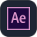
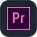

<picture>
  <source media="(prefers-color-scheme: dark)" srcset="https://raw.githubusercontent.com/ALPHISTUBE/ALPHISTUBE/main/assets/banner-dark.svg">
  <source media="(prefers-color-scheme: light)" srcset="https://raw.githubusercontent.com/ALPHISTUBE/ALPHISTUBE/main/assets/banner-light.svg">
  
</picture>

## About me

I'm a software developer who loves building things, from games and 3D web experiences to mobile apps, machine learning projects and even robotic hardware. It all started with curiosity about how things work, and it grew into a career I'm genuinely passionate about. I'm always learning something new.

- 🎮 **Games**: Unity, Unreal and Godot ([open-world survival](https://github.com/ALPHISTUBE/Unity-Open_world_survival), [Godot first game](https://github.com/ALPHISTUBE/Godot-First_Game))
- 🌐 **Web**: React, Next.js and interactive 3D on the web ([3D car game](https://github.com/ALPHISTUBE/web_3d_car_game), [3D item viewer](https://github.com/ALPHISTUBE/3d_item_view))
- 📱 **Mobile**: Flutter and Kotlin ([Skido](https://github.com/ALPHISTUBE/Skido))
- 🤖 **AI and vision**: TensorFlow, PyTorch and OpenCV ([data extraction AI](https://github.com/ALPHISTUBE/Data_extraction_AI))
- 🔧 **Hardware**: Arduino ([robotic hand](https://github.com/ALPHISTUBE/arduino_robotic_hand))
- 🎨 **Motion and 3D design**: Adobe suite and Blender

## Tech stack

**Languages**

         

**Frameworks and engines**

       

**AI, data and hardware**

     

**Design and 3D**

    

## GitHub activity

  <picture>
    <source media="(prefers-color-scheme: dark)" srcset="https://raw.githubusercontent.com/ALPHISTUBE/ALPHISTUBE/output/stats-dark.svg">
    <source media="(prefers-color-scheme: light)" srcset="https://raw.githubusercontent.com/ALPHISTUBE/ALPHISTUBE/output/stats-light.svg">
    
  </picture>
  <picture>
    <source media="(prefers-color-scheme: dark)" srcset="https://raw.githubusercontent.com/ALPHISTUBE/ALPHISTUBE/output/langs-dark.svg">
    <source media="(prefers-color-scheme: light)" srcset="https://raw.githubusercontent.com/ALPHISTUBE/ALPHISTUBE/output/langs-light.svg">
    
  </picture>

<picture>
  <source media="(prefers-color-scheme: dark)" srcset="https://raw.githubusercontent.com/ALPHISTUBE/ALPHISTUBE/output/snake-dark.svg">
  <source media="(prefers-color-scheme: light)" srcset="https://raw.githubusercontent.com/ALPHISTUBE/ALPHISTUBE/output/snake-light.svg">
  
</picture>

## Let's connect

 

